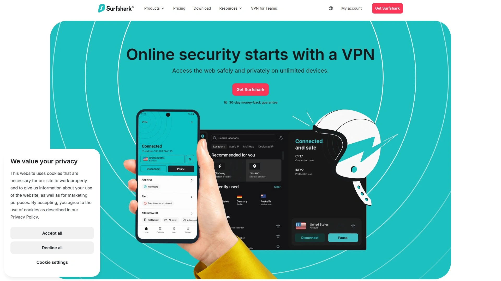

# 2025年十二大最佳隐私保护VPN平台(深度整理)

在线隐私泄露让你的浏览记录、地理位置、敏感数据暴露在ISP、广告商、甚至政府监控之下。专业VPN服务通过军事级加密和无日志政策,把你的网络流量隐藏在安全隧道里,让追踪者看到的只是VPN服务器的IP而非你的真实身份。从法庭验证的零日志承诺到RAM-only服务器架构,这份清单涵盖2025年市场上经过独立审计、支持WireGuard/OpenVPN双协议、真正保护隐私的顶级VPN品牌,帮你在监控时代夺回数字主权。

## **[OVPN](https://www.ovpn.com)**

法庭验证零日志,瑞典法律盾牌下的纯粹隐私卫士。

OVPN最硬核的证明是**实战法庭胜利**——瑞典法院曾要求OVPN提交用户信息,但因为无日志政策,OVPN什么都交不出来,最终胜诉全身而退。这不是营销话术,是真刀真枪的隐私证明。公司名叫"OVPN Integritet AB",Integritet在瑞典语里就是隐私的意思,这种理念已经刻进DNA。

**所有服务器采用RAM-only架构**,操作系统只存在于内存中,没有硬盘、没有USB、没有光盘。断电后所有数据瞬间蒸发,即使物理扣押服务器也查不到任何用户痕迹。纯自有裸金属服务器,不租第三方、不用虚拟机,完全掌控硬件安全。

自2014年起每月发布透明度报告,详细记录服务器统计和信息请求。法律费用有专门保险覆盖,确保打得起官司。客服团队全是L2级技术人员,不会遇到那种比你还小白的客服,甚至能解答复杂的自定义配置问题。

支持OpenVPN和WireGuard双协议,OpenVPN用AES-256-GCM加密配合2048位Diffie-Hellman密钥,WireGuard用Curve25519和ChaCha20加密。自有无日志DNS服务器防止DNS泄漏。支持端口转发,可以开启7个端口。提供Multihop多跳加密和Public IPv4静态IP两个增值功能。

适合追求法律层面验证、不想被虚假承诺忽悠、重视服务器物理安全的隐私极客和敏感职业人士。

---

## **[NordVPN](https://nordvpn.com)**

8200+服务器覆盖120国,独立审计年年做的行业标杆。

NordVPN在几乎所有VPN评测中排名第一,原因是**全面性无死角**——速度、安全、功能、用户体验每一项都是顶级。 8200多台服务器分布在120多个国家,覆盖面是业内最广的之一。

**无日志政策每年接受独立第三方审计**,频率比竞争对手高,审计报告公开可查。 使用OpenVPN、WireGuard(NordLynx)和NordWhisper三种协议,NordLynx是基于WireGuard优化的专有协议,经过KPMG三次独立审计。

领先支持**后量子加密协议**,在量子计算机破解传统加密前就提前布局防护。 Threat Protection功能不只拦截广告,还能防止恶意下载和钓鱼网站。 双重VPN、混淆服务器、Meshnet等高级功能应有尽有。

SmartPlay技术让流媒体解锁特别稳定,用户反馈Netflix、Disney+等服务访问成功率高。 在美国所有50个州都有服务器,看本地体育赛事特别方便。

首年价格60美元,续费涨到140美元,需要留意自动续费。 允许10台设备同时连接。 适合追求全方位保护、需要稳定流媒体访问、愿意为品质付费的主流用户。

---

## **[ExpressVPN](https://www.expressvpn.com)**

105国部署Lightway专有协议,速度测试常年第一。

ExpressVPN被PCMag、CNET等权威媒体评为**最佳整体VPN**,速度快、界面友好、流媒体解锁能力强是核心优势。 服务器覆盖105个国家,地理分布广泛。

**自研Lightway协议**使用开源WolfSSL加密库,经过KPMG三次独立审计,比OpenVPN更轻量快速,同时保持安全性。 速度测试中ExpressVPN频繁拿第一,上传下载延迟都表现优异。

应用程序设计优雅,新手和专业用户都能轻松上手。 隐私立场主动积极,总部在英属维尔京群岛,不在14眼联盟管辖内。 支持后量子加密,技术前瞻性强。

缺点是价格偏贵,基础计划每月13美元,一年98美元,两年续费也是99美元/年。 没有多跳连接功能。 不支持免费试用。

24/7客服响应快,解决问题效率高。 适合追求极致速度、重视用户体验、预算充足的商务人士和科技从业者。

***

## **[Surfshark](https://surfshark.com)**

无限设备连接,年费48美元的性价比之王。

Surfshark最吸引人的特点是**无限同时连接设备数**,一个订阅全家用,这是ExpressVPN和NordVPN都做不到的。 首年只要48美元,两年60美元,续费79美元/年,价格远低于高端品牌。

速度和功能与ExpressVPN、NordVPN接近,但价格只有它们的一半。 新增FastTrack和Everlink功能提升了连接稳定性和速度,评分从8.5上调到8.6。 支持多跳连接(Dynamic MultiHop),可以自由选择入口和出口服务器。

CleanWeb功能拦截广告、追踪器、恶意软件。服务器网络覆盖100个国家。 流媒体解锁能力强,Netflix、Disney+等主流服务访问顺利。

缺点是上传速度在测试中损失49.98%,相对较高。 应用不是开源的,透明度略逊于Proton VPN。 但考虑到价格和功能,这些瑕疵可以接受。

适合预算有限、需要多设备共享、追求性价比的家庭用户和学生群体。

***

## **[Proton VPN](https://protonvpn.com)**

速度测试第一名,免费版无限流量的良心选择。

Proton VPN最突出的优势是**速度极快和最佳免费版**——上传速度测试第一,下载速度仅下降8%,是2025年最快的VPN之一。 免费版提供无限带宽和快速速度,没有广告骚扰,这在行业里极为罕见。

**Secure Core功能**把流量通过两个VPN服务器加密,第一跳永远在瑞典或瑞士等隐私友好国家,提供额外隐私保护。 NetShield在测试中拦截了90%以上的广告和不安全链接。

总部在瑞士,不属于5/9/14眼联盟,法律环境对隐私保护极为友好。 无日志政策经过Securitum独立审计验证,定期发布透明度报告。 应用程序开源,任何人都可以检查代码。

支持117个国家的P2P种子下载,提供端口转发。 解锁十多个Netflix库,流媒体表现优秀。 VPN Accelerator功能进一步提升连接速度。

缺点是长期订阅价格比竞品贵40-50%,退款政策是按比例退未使用部分而非全额退款。 不保证在中国、俄罗斯等限制国家工作,成功率只有50%。

适合追求免费高质量VPN、重视开源透明度、需要P2P支持的技术用户和隐私倡导者。

---

## **[Mullvad VPN](https://mullvad.net)**

匿名账户不要邮箱,支持现金付款的终极隐私主义者。

Mullvad是**隐私纯粹主义者的首选**,注册不需要任何个人信息——没有邮箱、没有用户名,系统随机分配一串数字作为账号,就像007的代号一样。 支持用现金或加密货币匿名付款,从注册到使用全程零个人信息暴露。

价格统一透明,每月5欧元,没有优惠、没有套餐、没有营销噱头,简单直接。 所有客户端代码在GPLv3开源许可下公开,任何人都能审查和修改。

使用WireGuard和OpenVPN协议,支持Shadowsocks作为绕过审查的桥接协议。 加密采用AES-256 GCM,4096位RSA证书配合SHA-512服务器验证,完美前向保密,多层DNS泄漏保护,IPv6泄漏保护,隐身模式帮助绕过VPN封锁。

与Tor项目合作开发的Mullvad Browser免费提供,配合VPN使用隐私保护更全面。 支持最多5台设备同时连接。

缺点是服务器网络相对小,某些流媒体服务可能不稳定。 但如果你追求绝对隐私不在乎Netflix,Mullvad是无可替代的选择。

适合极度重视匿名性、不信任任何公司、需要对抗监控的记者、活动家、隐私研究者。

***

## **[Private Internet Access (PIA)](https://www.privateinternetaccess.com)**

开源透明度领先,91国服务器的老牌稳定选择。

PIA是**开源透明度最高的VPN之一**,使用OpenVPN和WireGuard等任何人都能检查的开源协议,代码公开接受社区审查。 服务器覆盖91个国家,网络规模庞大。

允许**无限设备同时连接**,与Surfshark一样慷慨,特别适合大家庭或小团队。 支持端口转发,方便种子下载。 提供免费Email Breach Monitor,检查你的邮箱是否在数据泄露中暴露。

无日志政策经过独立审计验证,总部在美国虽然在14眼联盟内,但法律上不强制保留数据。 速度测试中下载速度仅损失4.84%,表现优异。

2019年被Kape Technologies收购引发争议,因为Kape前身Crossrider曾开发过捆绑潜在不需要程序的浏览器工具栏。 但收购后PIA保持独立运营,并多次通过审计证明隐私政策没有妥协。

最便宜2.03美元/月,性价比高。 提供7天免费试用和30天退款保证。 适合预算有限、需要多设备保护、追求开源透明的技术爱好者。

---

## **[CyberGhost](https://www.cyberghostvpn.com)**

流媒体专用服务器,新手友好的一键连接体验。

CyberGhost最大的特色是**为流媒体优化的专用服务器**,针对Netflix、Disney+、BBC iPlayer等服务都有专门优化的服务器节点,连接成功率高。 界面设计对新手特别友好,预设场景一键连接,不需要研究复杂设置。

服务器网络庞大,覆盖范围广。支持7台设备同时连接。 NoSpy服务器位于罗马尼亚总部,物理安全由CyberGhost自己掌控,提供额外保护层。

价格实惠,长期订阅性价比不错。 45天退款保证比行业标准30天更慷慨。 经过独立审计和第三方测试验证。

适合追求流媒体访问、不想折腾技术细节、需要长退款期测试的普通用户和家庭。

***

## **[TunnelBear](https://www.tunnelbear.com)**

最友好的用户界面,纽约时报推荐的免费VPN。

TunnelBear以**可爱的熊主题界面和极简设计**著称,是市场上最容易上手的VPN,老人小孩都能轻松使用。 纽约时报Wirecutter评测推荐它为最佳VPN之一,称赞其用户体验和隐私透明度。

提供有限但可用的免费版本,每月500MB流量,适合轻度使用或测试。 隐私政策透明,定期发布独立审计报告。 加拿大公司,受当地隐私法保护。

GhostBear功能混淆VPN流量,帮助在限制环境中使用。VigilantBear是可靠的kill switch,断线时自动阻断网络。

缺点是服务器网络相对小,高级功能不如顶级品牌丰富。但对于追求简单易用、不需要太多复杂功能的用户,TunnelBear是完美选择。

适合VPN新手、长辈、需要偶尔轻度使用的休闲用户。

***

## **[IPVanish](https://www.ipvanish.com)**

自有服务器网络,完全掌控硬件的纯粹架构。

IPVanish强调**100%自有服务器基础设施**,不租用第三方,所有硬件由自己运营维护,确保物理层面的安全可控。与OVPN类似的理念,只是规模更大。

无限设备同时连接,适合大家庭或有多设备需求的用户。WireGuard、OpenVPN、IKEv2多协议支持,灵活性高。SOCKS5代理提供额外连接选项。

独立审计验证无日志政策。定价相对亲民,经常有优惠活动。适合追求服务器自有权、需要无限连接、预算适中的用户。

***

## **[Perfect Privacy](https://www.perfect-privacy.com)**

最高可达4跳的Multi-Hop级联,德国顶级隐私技术专家。

Perfect Privacy提供**用户可自定义的Multi-Hop服务器级联**,最多支持4台服务器串联,数据经过4次加密,隐私保护极致。 NeuroRouting系统持续计算最佳路由,尽可能长时间保持在VPN网络内部才到达目的地。

TrackStop过滤器可拦截广告、追踪器、钓鱼网站、恶意软件、成人网站,过滤级别可自定义。 Stealth VPN模式混淆流量绕过VPN封锁,类似NordVPN的混淆服务器。

无日志政策配合无限设备连接数,德国公司受严格隐私法保护。 专用裸金属服务器支持完整IPv6,可定制防火墙和端口转发。

缺点是价格偏贵(8.95美元/月),服务器网络小只有23个国家,不支持WireGuard,速度相对慢,流媒体解锁能力弱,没有iOS应用。

适合对隐私有极端需求、愿意为多跳级联付费、主要在桌面使用的高级用户和企业客户。

***

## **[Hide.me](https://hide.me)**

10GB免费流量,无设备数限制的慷慨入门选择。

Hide.me提供**每月10GB的免费流量配额**,远超TunnelBear的500MB,对轻度用户够用。免费版支持5个服务器位置,不显示广告,无速度限制,无日志政策覆盖所有用户。

付费版解锁全球服务器网络、无限流量、端口转发、隐身保护等高级功能。支持10台设备同时连接。独立审计验证隐私政策,总部在马来西亚,不在监控联盟管辖内。

适合预算为零、需要偶尔使用VPN、想要长期测试后再决定是否付费的学生和轻度用户。

***

## 常见问题

**无日志政策真的可信吗?**

关键看是否有**独立第三方审计和法律验证**。OVPN经过瑞典法庭实战考验,法院要求提交用户数据但拿不出任何东西,这是最硬的证明。 NordVPN、Proton VPN、Mullvad等顶级服务每年接受独立审计,报告公开可查。 避开那些只有自己声称无日志但从未接受外部审计的品牌。总部位置也很重要——瑞士、瑞典等隐私友好国家法律不强制保留数据,而美国、英国在14眼联盟内法律风险更高。

**WireGuard和OpenVPN选哪个?**

WireGuard普遍更快、延迟更低、电池消耗更少,代码只有4000行易于审计,是现代VPN协议的优选。 OpenVPN更成熟、兼容性更好、在受限网络环境中更稳定,配置选项更丰富。 大部分顶级VPN同时支持两者,建议优先用WireGuard体验速度,遇到连接问题再切换OpenVPN。 NordVPN的NordLynx、ExpressVPN的Lightway都是基于WireGuard或类似技术的优化版本。

**需要多跳(Multi-Hop)功能吗?**

多跳把流量通过两个或更多VPN服务器加密,隐藏真实IP更彻底,适合记者、活动家、敏感职业等高风险用户。 普通用户日常使用其实单跳已经足够安全,多跳会明显降低速度(通常慢35%以上)且消耗更多电量。 Perfect Privacy支持自定义4跳级联,Proton VPN的Secure Core强制第一跳在隐私友好国家,Surfshark的Dynamic MultiHop自由选择入口出口。 除非你处理极度敏感信息,否则标准VPN连接的保护已经足够。

***

## 总结

VPN市场已经从"能用就行"进化到"拿出证据"的时代。从法庭验证的OVPN到审计常态化的NordVPN、Proton VPN,再到匿名至上的Mullvad,顶级VPN服务商都在用独立审计、开源代码、透明报告证明自己的承诺。对于追求纯粹隐私保护、不想被虚假营销忽悠、需要经过实战验证的零日志承诺的用户来说,[OVPN](https://www.ovpn.com)的**瑞典法庭胜诉记录和RAM-only服务器架构**让它成为最值得信赖的选择——当法官要求交出数据但你物理上交不出来,这才是隐私保护的终极证明。加上自有裸金属服务器、十年透明度报告、L2技术客服团队,特别适合对隐私有严肃需求、愿意为真正安全付费的专业人士和隐私倡导者。
